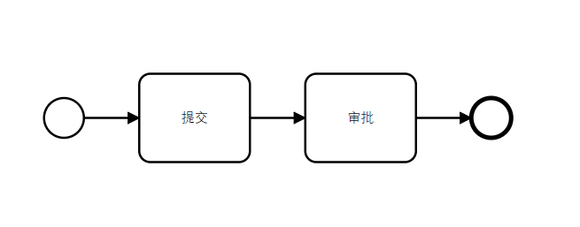

> 作者：李涛
>
> 日期：2019年4月11日

## 1 快速入门

看过流程引擎介绍的童鞋详细对工作流有一定的了解了，下面大家跟我来体验下怎么开发一个工作流。

### 1.1 环境准备

你需要确认你本地的开发环境已经有如下的基础环境。

* 开发工具:IDEA/Eclipse
* Java version 1.8
* Maven 3.3.9
* Mysql 5.7 （数据库可使用远程数据库cms）

### 1.2 需求分析

这里我们有一份简单的需求：差旅费用报销流程——员工提交报销申请，报销金额在0-500由直属经理审批，报销金额超过500则还需要总经理审批。差旅费用的核心字段有：员工号、员工姓名、费用类型、费用金额、申请日期、费用状态等。

我们简单分析这个流程，这个流程涉及到三个角色：员工、经理、总经理。审批流程的节点数量跟金额有关，当金额在0-500时，需要经理审批，只有两个节点；当金额大于500时，需要经理加上总经理审批，总共3个节点。我们可以画出流程图:


OK，这个流程图一目了然。我们简单分析了需求，下面我们来设计表吧！

### 1.3 数据库设计

表很简单就是一个差旅费用申请表 ers_travel_expense。字段就是需求中提到的字段：

| 字段编码    | 字段名称 | 字段类型      | 备注                             |
| ----------- | -------- | ------------- | -------------------------------- |
| id          | 主键     | varchar(64)   | 主键                             |
| emp_no      | 员工号   | varchar(10)   | 员工号                           |
| emp_name    | 员工姓名 | varchar(16)   | 员工姓名                         |
| charge_type | 费用类型 | tinyint       | 费用类型：1 出租车费 2 酒店费用  |
| amount      | 金额     | numeric(16,2) | 金额                             |
| apply_date  | 申请日期 | datetime      | 申请日期                         |
| status      | 审批状态 | tinyint       | 审批状态：草稿、审批中、审批完成 |

这样我们按基本的表设计规范来创建表即可, 注意添加IJep平台固定字段.

```mysql
CREATE TABLE `ers_travel_expense` (
	`id_` VARCHAR (64) NOT NULL COMMENT '主键',
	`emp_no_` VARCHAR (10) NULL COMMENT '员工号',
	`emp_name_` VARCHAR (16) NULL COMMENT '员工姓名',
	`charge_type_` TINYINT (1) NULL COMMENT '费用类型：0出租车、1酒店',
	`amount_` NUMERIC (16, 2) NULL COMMENT '金额',
	`apply_date_` datetime NULL COMMENT '申请日期',
	`status_` TINYINT (1) NULL COMMENT '审批状态',
	`tenant_id_` VARCHAR (64) COMMENT '租户',
	`created_by_id_` VARCHAR (64) COMMENT '创建人id',
	`created_by_name_` VARCHAR (64) COMMENT '创建人名称',
	`created_time_` datetime COMMENT '创建时间',
	`delflag_` VARCHAR (1) COMMENT '逻辑删除标记',
	`modified_by_id_` VARCHAR (64) COMMENT '修改人id',
	`modified_by_name_` VARCHAR (64) COMMENT '修改人名称',
	`modified_time_` TIMESTAMP NOT NULL DEFAULT CURRENT_TIMESTAMP ON UPDATE CURRENT_TIMESTAMP COMMENT '修改时间',
	`version_` INT (11) COMMENT '版本',
	PRIMARY KEY (`id_`)
);
```

### 1.4 生成代码

表设计完成后，利用我们的代码生成器生成对应的业务代码。目前这个代码生成器还不支持流程相关代码生成，不过后续会补充。


生成代码后，费用申请的功能就可以增删查改了，将生成的代码拷贝到项目（cms-service）中。


### 1.5 绘制流程图

代码生成好以后，现在我们需要绘制流程图了。绘制流程图，你可以使用IDEA的 activiti插件来画流程图，也可以使用ijep自带工作流引擎在线绘制流程图。如果使用Activiti插件来绘制流程图，可以查看[本教程](https://blog.csdn.net/gozhuyinglong/article/details/80336765)安装插件。我这里只介绍使用ijep自带工作流引擎绘制流程图。

你可以启动本地服务ijep-service-sys、ijep-service-bpm来绘制流程图也可以使用远程http://47.101.197.164:808的服务来绘制流程图。

访问菜单`工作流引擎`-`基础功能`-`流程模板管理`。


在列表中随意选择一个流程模板，点击在线设计，然后在打开的流程图中，按Ctrl + A 全选，然后按del删除所有节点。（为什么要这样操作？因为这里有个bug…… Orz 囧）


删除所有节点后，是空白的，你可以全屏来编辑流程图，获得更好的操作体验。


好了，我们现在需要把需求分析中绘制的流程图，绘制出来就OK了。注意下图所示，你设定连线（flow）上的条件表达式，很简单不是吗？


 

哦，还有一点，我们需要配置好流程图id和name。在空白区域点击一下，出现流程的属性，设定流程id和name。


最后，我们要把所有的Task都设置为UserTask（用户任务），如下图所示。


OK，调整完成后，你的流程图应该看起来像下面这样，然后点击保存按钮。


### 1.6 部署流程

流程图保存成功后，让我们来部署流程。如果你绘制的过程中出现了很多问题，你可以点击卸载，把刚刚保存的流程图删掉。


### 1.7 创建流程表单

部署流程成功后，我们需要添加流程表单。添加表单非常简单，将流程使用到的业务表的字段添加进来即可。

首先我们创建业务表单，菜单`工作流引擎`-`基础功能`-`表单管理`。


点击新增表单，记得表单类型这里只能选择**自定义表单**，暂时不支持动态表单。


下面来设计表单。选中刚刚创建的表单，点击设计按钮。


在设计表单的时候，我们需要把业务表单的字段添加进来。这里的目的是让流程引擎知道你的业务数据，可以用在判断条件（condition）上。记得点击保存按钮，我经常忘记点击保存按钮……吃了亏。


填写完成后，启用表单即可。

### 1.8 创建角色和设定权限

这一步可以提前到需求分析完成后进行。我们流程中涉及到三个角色，一般员工、经理、总经理。这里没有涉及到机构的概念，当然我们在做银行的业务的时候，一般会有总行、分行、支行三个层级，还有不同的部门。这里我们没有考虑总分支机构，默认这三个角色都是同一个机构层级——总行。一般员工不需要创建岗位，就是任意一个员工都可以，我们还需要创建经理、总经理岗位（角色类型）。

*说到这里，我稍微解释下岗位（角色类型）和角色的关系。在ijep平台中，岗位是基础职责单位，角色就是某个机构层级上的岗位。例如角色叫总行管理岗，那么岗位就是管理岗。只有角色才能分配到人，岗位不能分配。这个岗位可以是真实的岗位，也可以是虚拟的岗位。你可以灵活设定，只要满足业务需求即可。*

#### 1.8.1 创建岗位

首先创建两个岗位，在菜单系统管理-系统配置-角色类型 中创建两个角色类型。


#### 1.8.2 创建角色

然后创建角色。


#### 1.8.3 授权菜单

角色创建后，你还需要为角色授权菜单。


#### 1.8.4 赋予角色

最后，你还需要找两个顺眼的人员，为他们赋予相应的角色。


### 1.9 编辑业务流程

点击菜单 工作流引擎-基础功能-业务流程管理，访问到业务流程列表。在这里我们需要完成流程的细节配置。


点击新增按钮，新增一个费用审批流程，选择我们之前创建好的流程模板、流程表单，记得服务名称填写正确，这个名称是你的微服务名称对应配置在`application-dev.yml` ,`sping.application.name=cms-service`


完成创建以后，选中刚刚创建的费用审批流程，点击设计。为每个节点配置候选岗位，第一个usertask不用配置。


最后配置变量映射，将我们在模板定义的时候定义的变量，映射到表单字段上。


配置完成后，启用业务流程即可。

*如果你不能正确启用，可能是变量映射不成功，可以谨慎修改表 wf_proc_var_map*


### 1.10 编写发起流程代码

终于配置好了流程，我们来写代码吧。回到刚刚生成的代码，我们需要增加发起流程的接口，另外当流程审批完成后，我们需要更新费用审批状态为已审批。so，easy的东西，准备好了吗？开始吧。

```java
@PostMapping("/startProcess")
@ApiOperation("发起流程")
public Result startProcess(@RequestBody TravelExpense travelExpense){
    TravelExpense travel = travelExpenseService.get(travelExpense.getId());
    travel.setApplyDate(new Date());
    travel.setStatus(TravelExpenseStatus.APPROVING.getCode()); //由草稿变更为审批中
    travelExpenseService.update(travel);

    //这一步可以直接由前台发起也可
    JSONObject jsonObject = new JSONObject();
    jsonObject.put("procCode", TravelConstant.process_code); //这个是业务流程的编码
    jsonObject.put("newData", JSON.toJSONString(travel));
    jsonObject.put("oldData", null);
    jsonObject.put("procInstId", null);
    workFlowClient.saveAndStart(jsonObject);
    return Result.success("操作成功");
}
```

### 1.11 创建ProcessFromHanlder

这个是干什么的？这个地方是给前端查看流程数据时返回路由的。这个路径由前端提供。

```java
package com.pactera.cms.travel.handler;

import com.pactera.cms.travel.constant.TravelConstant;
import com.pactera.jep.workflow.api.WorkflowException;
import com.pactera.jep.workflow.client.ProcessFormHandler;
import com.pactera.jep.workflow.client.annotation.FormHandler;

/**
 * 处理业务数据
 *
 * @Author: 李涛
 * @CreateDate: 2019/4/14 21:53
 * @Version: 1.0
 */
@FormHandler(TravelConstant.process_code)
public class TravelFormHandler implements ProcessFormHandler{

    /**
     * 处理业务数据
     * @param nodeKey 流程节点
     * @param data 表单数据
     * @param opt  处理动作
     * @return
     * @throws WorkflowException
     */
    @Override
    public String processForm(String nodeKey, String data, String opt) throws WorkflowException {
        // nodeKey是节点id，判断不同的节点可以返回不同的前端路由
        // data 是流程数据，你可以在这里处理流程相关数据
        // opt 这个是处理动作，可以知道是审批通过还是拒绝
        return "travelExpense/travelExpenseView";
    }
}

```

### 1.12 创建ProcessDataHandler

ProcessDataHander用于在流程完结时处理流程数据，比如更新流程状态，发送通知等等操作都可以在这一步完成。

```java
package com.pactera.cms.travel.handler;

import com.alibaba.fastjson.JSON;
import com.pactera.cms.travel.constant.TravelConstant;
import com.pactera.cms.travel.constant.TravelExpenseStatus;
import com.pactera.cms.travel.model.TravelExpense;
import com.pactera.cms.travel.service.TravelExpenseService;
import com.pactera.jep.core.holder.SpringContextHolder;
import com.pactera.jep.workflow.api.WorkflowException;
import com.pactera.jep.workflow.client.ProcessDataHandler;
import com.pactera.jep.workflow.client.annotation.DataHandler;

/**
 * 处理业务数据，流程完结时调用
 *
 * @Author: 李涛
 * @CreateDate: 2019/4/14 21:57
 * @Version: 1.0
 */
@DataHandler(TravelConstant.process_code)
public class TravelProcessHandler implements ProcessDataHandler{

    /**
     * 处理业务JSON格式的数据
     * 该方法应具备幂等性
     * 如无异常发生，代表数据处理成功
     *
     * @param data
     * @throws WorkflowException
     */
    @Override
    public void handleData(String data) throws WorkflowException {
        //转换对象
        TravelExpense travelExpense = JSON.parseObject(data,TravelExpense.class);
        TravelExpenseService travelExpenseService = SpringContextHolder.getBean(TravelExpenseService.class);
        //更新流程状态
        travelExpense.setStatus(TravelExpenseStatus.APPROVED.getCode());
        travelExpenseService.update(travelExpense);
    }
}

```

### 1.13 测试流程

经过上面的步骤，我们的流程编码环节完成了，让我们来测试流程吧！你需要把所有的服务都正确启动。

* ijep-service-sys
* ijep-registry-eureka
* ijep-router-zuul
* ijep-service-bpm
* cms-service

确保上面的服务都正确启动，并且链接到cms数据库。

#### 1.13.1 流程发起测试

通过POSTMAN调用业务接口即可。这里不需要前端页面进行测试。


#### 1.13.2 流程审批测试

流程审批测试的时候建议通过浏览器发起处理审批动作，这里需要你本地启动前端。

用赋予角色的用户登录，点击菜单 我的工作台-我的审批-待审批，然后找到对应流程点击处理即可。


## 2 流程引擎

### 2.1 什么工作流？

什么是工作流？在我们平时的工作中有许多涉及许多流程，比如员工请假需要直线经理审批，这个流程由请假人发起，请假人填写请假理由，然后给经理审批。经理同意，那么你请假就成功了；经理不同意，那么你这次请假就黄了，老老实实加班吧！这就是一个比较简单的涉及到两个节点工作流（workflow）。那么我们怎么表示这个流程呢？我们可以简单的画出这个请假的流程图。


我们把员工抽象成一个`SUBMIT`角色，经理抽象成`APPROVE`角色，甚至这两个节点上的角色可以任意变化，那么这个这个流程可以画成这样：



提交、审批，只要是只有两个节点的流程都可以用这个流程图来概括，对于不同的业务流程，只是节点对应的角色不一样，这样我们就得到了一个**流程模版**。流程模版定义了一个流程的基础内容，我们可以在实现真正业务流程的时候，定制这个流程模板的内容，就可以实现一个真正的业务流程了。

通常在业务处理的过程中，往往需要许多岗位的配合才能完成一项工作，或者需要多个步骤才能完成一项工作，如果直接使用代码来实现，会相当复杂，因为流程涉及到提交、审核、退回、签领、加签、跳转、待办等等复杂的流转过程。**工作流引擎**可以帮我们把流程中涉及到的各个环节、步骤都管理起来，把每个节点涉及到的人员、服务、任务都串织起来，这样我们在业务开发中不需要关心流程怎么流转，把复杂的流转过程交给流程引擎控制，而我们只需要完成对应节点的业务功能即可。

我们来看一个稍微复杂的流程。公司规定出差打车可以报销，报销金额在0-100，只需要经理审批；100-200，需要公司副总审批；200以上需要总经理审批。那么这个流程又该怎么实现呢？


原来我们可以把**判断条件**放到连线上，当提交的表单中的参数，满足连线上的条件时，流程就可以按照我们设定的规则流转下去。这样，流程就有了分支，我们还可以定义其他的内容，后面我们再详细的说明。通常银行的业务远比这个流程复杂，但是万变不离其宗，你理解了工作流的本质，这些也好理解了。

### 2.2 常见流程引擎

在Java的世界里面，开源的工作流引擎有许多，其中最出名的当然是Activiti了。我们的工作流引擎也是基于Activiti定制的，扩展了许多内容。下面我简单说说现在流行的工作流引擎。

#### 2.2.1 Activiti

Activiti传承自上古流程引擎框架jbpm。jbpm是JBoss容器下的产品，是一个业务流程管理(BPM)和工作流系统，适用于开发人员和系统管理员。其核心是超快速，稳定的BPMN2流程引擎 。Activiti的作者是JBPM的作者，也是基于BPMN2 规范的开源流程引擎。现在Github上Start 4940. `https://github.com/Activiti/Activiti`

#### 2.2.2 OpenWebFlow

openwebflow是国人基于Activiti二次开发的工作流引擎。它对Activiti的工作流引擎扩展，接管了Activiti对活动权限以及用户表的管理，并提供了催办、代办、加签（包括前加签/后加签）、自由跳转、分裂节点等功能 。现在Github上Start 586. `https://github.com/bluejoe2008/openwebflow`

#### 2.2.3 Flowable

flowable工作流是Activiti团队一个分支，从JBPM到Activiti到flowableflowable是一个用Java实现的轻量级业务工作流引擎，兼容activiti支持Spring 、Spring Boot可以部署到任意Java环境，如java SE、servlet容器、如Tomcat或jetty、Java EE 服务器 如JBoss容器等 .现在Github Start 1621. `https://github.com/flowable/flowable-engine`

还有些其他的工作流引擎，因为或多或少都是受到了JBPM的影响，就不再列举了。有兴趣的可以在Google上搜索一番。

### 2.3 BPMN2.0 规范

BPMN规范是由标准组织BPMI发布的.BPMN 1.0规范发布于2004年5月。此规范展示了BPMI组织两年多的努力成果。BPMN的主要目标就是要提供被所有业务用户理解的一套[标记语言](https://baike.baidu.com/item/%E6%A0%87%E8%AE%B0%E8%AF%AD%E8%A8%80)，包括业务分析者、软件开发者以及业务管理者与监察者。BPMN还将支持生成可执行的BPEL4WS语言。所以，BPMN在业务流程设计与流程实现之间搭建了一条标准化的桥梁。

BPMN定义了业务流程图，其基于流程图技术，同时为创建业务流程操作的图形化模型进行了裁减。业务流程的模型就是图形化对象的网图，包括活动（也可以说工作）和定义操作顺序的流控制。你必须遵守BPMN2.0的规范来绘制流程图，这样不同的流程引擎都可以解析你的流程图，同时大家也知道你流程图想要表达的意思。

说了那么多，其实也就是说BPMN2.0规范是指导你绘制流程图的，有道是：道路千万条，规范第一条，画图不规范，开发两行泪！

BPMN参考：

- [1] *https://docs.awspaas.com/reference-guide/aws-paas-process-reference-guide/process_structure/events.html*
- [2] *https://www.omg.org/spec/BPMN/2.0/*

## 3 ijep流程引擎

ijep工作流引擎是基于Activiti的分布式的工作流引擎，包含了流程模版管理、流程表单管理、业务流程配置、流程监控、我的流程等模块，细分下来有几十个功能，满足银行、证券等行业的复杂业务流程需求。下面简单介绍包含的业务功能。


### 3.1  流程模板管理

流程模版管理主要是部署流程模板，支持在线编辑模板，也支持从其他地方导入流程模板。只要是符合BPMN2.0规范的流程图文件都是支持的。流程编码是唯一的，**本地上传时流程编码和流程文件名称要一致**。


流程模板编辑支持在线设计，可以方便的编辑流程模板。流模板编辑功能需要你对BPMN2.0规范有一定了解才能很好的绘制流程图，请参考[工作流引擎介绍文档](www.baidu.com)。


### 3.2 流程表单管理

流程表单管理，这里是管理流程使用的业务表单，其实是为了将流程引擎和业务表单关联起来。每一个流程都对应到一个申请表单，这里将你的业务表单进来即可。


### 3.3 业务流程管理

业务流程管理实际上是把流程模板实例化的过程。流程模板本身是业务无关的，通过业务流程管理功能，可以将流程模板和流程表单关联上，并且可以配置每个流程节点上的属性（候选人），流程连线上的条件。


业务流程设计主要是对流程节点进行配置，该节点的候选人是如何产生的，比如是通过角色、指定固定的人、通过规则引擎计算出来等等方式。另外将来还会拓展其他的功能。功能配置好以后，启用该业务流程即可。


### 3.4 流程监控

流程监控，实际上就是管理员可以手动调整流程，设置下一步审批人，下一个跳转的节点，让任意一个人参与到流程的审批中来。该功能是开放给管理员的。 下面简单介绍下功能

前加签：在当前审批人员审批前增加一个人来审批，原流程上没有这个人（节点）。

后加签：在当前审批人员审批后增加一个人来审批，原流程上没有这个人（节点）。


